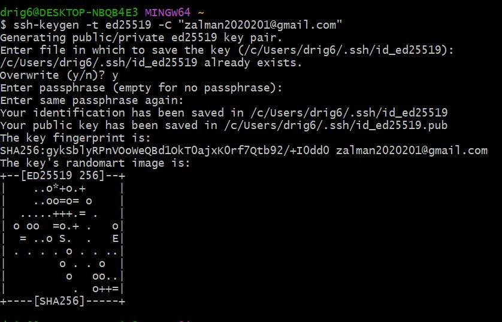
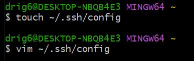
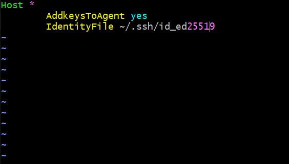
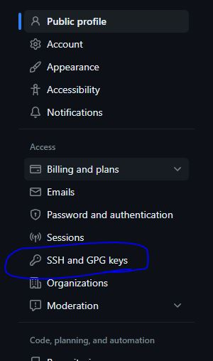
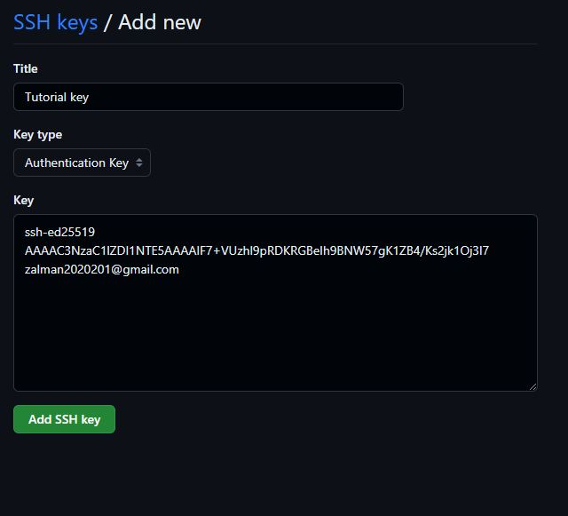

1. hét
======

Technikai dokumentáció
----------------------

Összehasonlítás Markup (jelölő nyelvekről), például MarkDown, reStructuredText
^^^^^^^^^^^^^^^^^^^^^^^^^^^^^^^^^^^^^^^^^^^^^^^^^^^^^^^^^^^^^^^^^^^^^^^^^^^^^^

**Markdown és Sphinx előnyei és hátrányai:**

    +-------------------------------------------------+-----------------------------------------------+
    | | Markdown Előnyei                              | | Markdown Hátrányai                          |
    +=================================================+===============================================+
    | | Egyszerűbb és könnyebb nyelv a megtanulásához | | Korlátozottabb formázási lehetőségek vannak |
    | | és használatához.                             | | a rST-hez képest.                           |
    +-------------------------------------------------+-----------------------------------------------+
    | | Könnyen olvasható és írható intuitív szintaxi-| | Nincsenek beépített támogatások speciális   |
    | | sa van                                        | | elemekhez, például táblázatokhoz vagy       |
    | |                                               | | bonyolultabb struktúrákhoz                  |
    +-------------------------------------------------+-----------------------------------------------+
    | | Széles körben támogatott és használt a weben  | | Előfordulhat hogy hiányoznak specifikus     |
    | | és más platformokon                           | | funkciók vagy kiterjesztések, amelyeket más | 
    | |                                               | | jelölőnyelvek például rST vagy HTML         |
    | |                                               | | támogatnak                                  |  
    +-------------------------------------------------+-----------------------------------------------+
    | | A Markdown dokumentumok egyszerűen            | |                                             |
    | | átalakíthatók HTML-re, vagy más formátumokra  | |                                             |
    +-------------------------------------------------+-----------------------------------------------+
    | | Kevesebb szintaktikai elemet használ, így     | |                                             |
    | | kevesebb figyelmet kell fordítani a formázás  | |                                             |
    | | részleteire                                   | |                                             |
    +-------------------------------------------------+-----------------------------------------------+

    +-------------------------------------------------+-----------------------------------------------+
    | | reStructuredText (rST) előnyei                | | reStructuredText (rST) hátrányai            |
    +=================================================+===============================================+
    | | Széles körű támogatást és integrációt kínál a | | Bonyolultabb és részletesebb szintaxissal   |
    | | Sphinx dokumentációs rendszerrel amely        | | rendelkezik, amelynek elsajátítása időbe    |
    | | erőteljes dokumentáció-generálási             | | telhet                                      |
    | | eszközkészlet                                 | |                                             |
    +-------------------------------------------------+-----------------------------------------------+
    | | Gazdagabb formázási lehetőségeket és          | | Kisebb mértékű támogatása és elterjedtsége  |
    | | szintaktikai elemeket kínál a Markdownhoz     | | lehet más platformokon és eszközökben       |
    | | képest például táblázatok kereszthivatkozások | | a Markdownhoz képest                        |
    | | direktívák stb,                               | |                                             |
    +-------------------------------------------------+-----------------------------------------------+
    | | Támogatja a bonyolultabb dokumentumstruktúrá- | | A formázás részleteire jobban oda kell      |
    | | kat, amelyek nagyobb projektek vagy komplexebb| | figyelni, ami időigényesebb lehet           |
    | | tartalmak esetén hasznosak lehetnek           | |                                             |
    +-------------------------------------------------+-----------------------------------------------+
    | | Az rST dokumentumok átalakíthatók más         | |                                             |
    | | formátumokba például HTML PDF vagy LaTeX      | |                                             |
    +-------------------------------------------------+-----------------------------------------------+

További alternatívák vizsgálata
^^^^^^^^^^^^^^^^^^^^^^^^^^^^^^^

További alternatíva vizsgálatának a LaTeX nyelvet választottam. Felelevenítettem a tudásomat, amit előző félévben tanultunk.

Áttekintés az elvégzett vizsgálatokról MS Word docx (vagy LibreOffice Writer odt) formátumban.
^^^^^^^^^^^^^^^^^^^^^^^^^^^^^^^^^^^^^^^^^^^^^^^^^^^^^^^^^^^^^^^^^^^^^^^^^^^^^^^^^^^^^^^^^^^^^^

https://github.com/Ddavid111/Szakmai-gyak

Git
---

Alapvető fogalmak és működés áttekintése.
^^^^^^^^^^^^^^^^^^^^^^^^^^^^^^^^^^^^^^^^^

**Alapparancsok**

- `cd`: mappákba lépés, navigálás
- `mkdir`: mappa létrehozása
- `cd ..`: adott mapából visszalépés
- `pwd`: útvonal (ösvény)
- `ls`: mappa tartalmának listázása
- `clear`: tiszta üres felület
- `whoami`: felhasználónév megjelenítése
- `git help`: súgó megjelenítése
- `touch demo.txt`: demo szöveges álomány létrehozása

**Gittel kapcsolatos alapparancsok**

- `git init`: inicializálja a git repositoryt
- `git status`: aktuális könyvtár állapota
- `git add <fájlnév>`: adott fájl hozzáadása
- `git add .` : több fájl hozzáadása
- `git commit -m "FirST Commit"`: változtatások rögzítése opcionálisan üzenettel is
- `git remote add origin <távoli repository URL-je>`: létrehozza a kapcsolatot a helyi és a távoli repository között, és lehetővé teszi a közöttük lévő adatok cseréjét és szinkronizálását
- `git remote set-url origin <távoli repository URL-je>`: ezzel a parancsal megváltoztathatjuk a távoli repository URL-jét, ha például szeretnénk másik távoli repositoryra mutatni
- `git remote -v`: a távoli repository-kat és azok URL-jeit jeleníti meg a helyi repositoryban
- `git push origin master`: a helyi master branch tartalmának feltöltésére (push-olására) használhatunk a távoli origin repositoryba
- `git pull --rebase origin master`: ez a parancs letölti a legújabb változtatásokat a távoli origin repositoryból, majd átrendezve alkalmazza a helyi változtatásokra.

Haladó témakörök: branch-elés, merge, tagging, rebase
^^^^^^^^^^^^^^^^^^^^^^^^^^^^^^^^^^^^^^^^^^^^^^^^^^^^^

**Branch-elés**

A branchelés a Git egyik alapvető funkciója, amely lehetővé teszi az elkülönült fejlesztési ágak létrehozását a projektben.
A branchek segítségével különböző változtatásokat végezhetünk az adott ágon anélkül, hogy befolyásolnánk a többi ág fejlesztését.

*Lépései*

1. Új branch létrehozása: ``git branch <branchnév>`` 

.. code:: 

    git branch new

2. Átváltás a branchre: ``git checkout <branchnév>``

.. code:: 

    git checkout new

3. Branchek listázása: ``git branch`` (Az aktuális branchet a "*"-al jelölik.)

.. code::

    git branch

4. Pusholás: ``git push origin new``

.. code::

    git push origin new

5. Eredmény:

.. image:: images/Branch/branch_5.jpg

**Merge**

Különböző branchek összeolvasztására használjuk. 
A ``merge`` folyamata során a Git automatikusan összefűzi (integrálja) a két különböző branch változtatásait, és létrehoz egy új commitot, amely a változtatásokat tartalmazza.

.. code::

	git merge <branchnév>

**Tagging**

Amely lehetővé teszi az adott commitok vagy verziók megjelölését a repositoryban. 
A ``tag`` egy nevet vagy azonosítót ad a commitnak, hogy könnyen hivatkozhassunk rá később.

.. code::

	git tag <tagnév>

Eredmény:

.. image:: images/Tag/tag_2.jpg

**Rebase**

A ``rebase`` folyamata során a Git lehetővé teszi a commitok átrendezését és az ágak összefűzését

.. code::

	git rebase <branchnév>

SSH kulcsok generálása (ssh-keygen, ssh-agent)
^^^^^^^^^^^^^^^^^^^^^^^^^^^^^^^^^^^^^^^^^^^^^^

Az SSH-kulcsok (Secure Shell keys) a Secure Shell (SSH) protokollhoz kapcsolódó kriptográfiai kulcsok, amelyeket azonosításra és az adatok biztonságos titkosítására használnak a számítógépes hálózatokban.

Az SSH-kulcsoknak két komponense van: a privát kulcs (private key) és a publikus kulcs (public key).

- Privát kulcs: Ez a titkos kulcs, amelyet csak a kulcspárhoz tartozó személy vagy entitás ismer. A privát kulcs fontos biztonsági elem, és biztonságosan kell tárolni. Ezt a kulcsot használja a felhasználó az azonosításra a távoli számítógépen vagy szerveren.

- Publikus kulcs: Ez a kulcs a privát kulcspárral párosítva van. A publikus kulcs szabadon megosztható, és a távoli szerveren tárolódik. Amikor egy felhasználó csatlakozik egy szerverhez, a publikus kulcsot használja az azonosításhoz. A szerver ellenőrzi, hogy a publikus kulcs megfelel-e a tárolt kulcshoz, és ha igen, engedélyezi a hozzáférést.

*Lépései*

#. Nyissuk meg a Git Bash-t.
#. Gépeljük be a következő parancsot:

.. code::

    ssh-keygen -t ed25519 -C "your_email@example.com"

A "your_email@example.com" helyére írjuk be a saját e-mail címünket.

3. Az ``eval "$(ssh-agent -s)"`` parancs az ssh-agent indítására szolgál a Git Bash-ben. Az ssh-agent egy program, amely kezeli és tárolja a privát SSH-kulcsokat, és hozzáférést biztosít nekik a hitelesítés során.

.. code::

    eval "$(ssh-agent -s)"

4. Létrehozunk egy üres fájlt a .ssh mappában és szerkesztjük azt.

.. code::

    touch ~/.ssh/config
    vim ~/.ssh/config

    Host *
         AddkeysToAgent yes
         IdentityFile ~/.ssh/id_ed25519

Ez a konfiguráció azt eredményezi, hogy az SSH-kulcsok automatikusan hozzáadódnak az ssh-agent-hez, amikor azokat használjuk a Git Bash-ben. Ez megkönnyíti az SSH-kulcsok kezelését és az azonosítás folyamatát, mivel nem kell újra megadni a jelszót minden egyes Git művelet során, amely az SSH-kulcsokat igényli. Az IdentityFile beállítás pedig meghatározza az Ed25519 privát kulcs fájl elérési útvonalát és nevét az ~/.ssh/id_ed25519-en keresztül.

5. Az ``ssh-add ~/.ssh/id_ed25519`` parancsot használhatjuk a Git Bash-ben az Ed25519 privát kulcs hozzáadásához az ssh-agent-hez. Az ssh-add parancs segítségével hozzáadhatjuk a privát kulcsot az ssh-agent-hez, hogy az a kulcs felhasználható legyen az azonosításhoz.

.. code::

    ssh-add ~/.ssh/id_ed25519

6. Nyissuk meg a Githubot és készítsünk egy új ssh kulcsot. A ``cat ~/.ssh/id_ed25519.pub`` parancsot használhatjuk a Git Bash-ben az Ed25519 publikus kulcs tartalmának megjelenítéséhez. Az id_ed25519.pub fájl a publikus kulcs fájlja, amelyet generáltunk az Ed25519 kulcspárhoz.

.. code::

    cat ~/.ssh/id_ed25519.pub

 
7. Repository klónozás. Githubon az egyik repository-nál válasszuk ki az ssh fült és másoljuk ki a szöveget, majd a megfelelő paranccsal hajtsuk végre a klónozást.

.. code::

    git clone <repository ssh hivatkozása>

+ Könyvek, linkek átnézése

