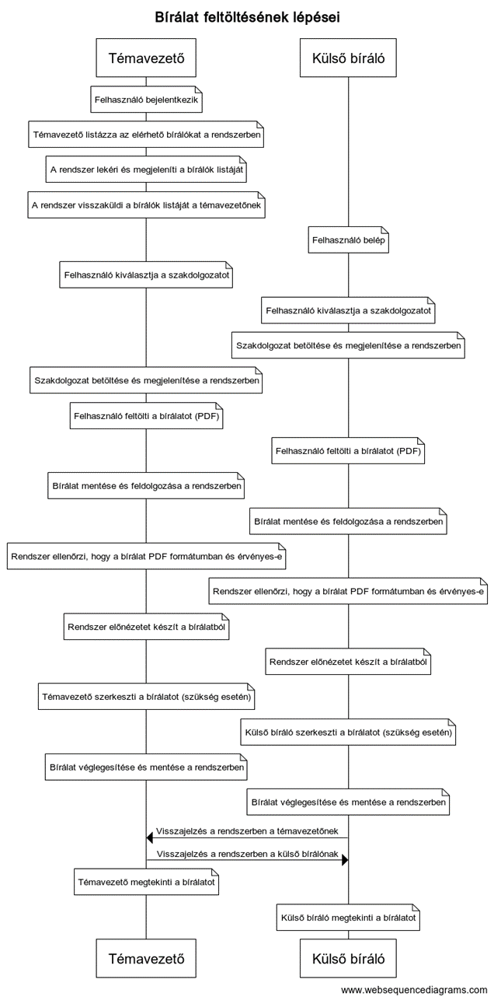
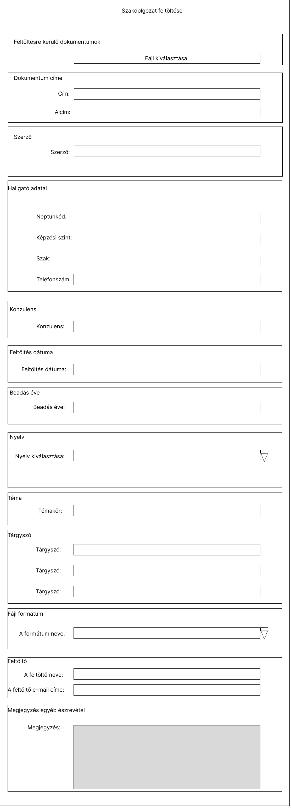

2. -  3. hét
======

Repository létrehozása
----------------------

https://github.com/Ddavid111/Szakmai_Gyakorlat

Folyamat ábrázolása
-------------------

.. image:: images/Szekvenciadiagramok/1.jpg

.. literalinclude:: source_codes/webseqeunce_diagram1.txt

**Leírás**

 A rendszer célja, hogy hatékonyan kezelje a szakdolgozatok bírálati folyamatát és a kapcsolódó érintett szereplők közötti kommunikációt. A leírás az alábbi lépéseket foglalja össze:

 #. **Elnök felkéri a Hallgatót a regisztrációra:** A folyamatot az Elnök indítja, amikor felkéri a Hallgatót, hogy regisztráljon a rendszerbe. Ez a lépés azt jelenti, hogy a Hallgatónak lehetősége van hozzáférni a szakdolgozat bírálati folyamatához.
 
 #. **Hallgató sikeresen regisztrál:** A Hallgató sikeresen regisztrál a rendszerbe, és így jogosultá válik a szakdolgozatának bírálati folyamatára.
 
 #. **Elnök felkéri a Témavezetőt a bírálatra:** Az Elnök felkéri a Témavezetőt, hogy végezze el a szakdolgozat bírálatát. Ez a lépés azt jelzi, hogy a Témavezetőnek feladata van értékelni és észrevételeket tenni a szakdolgozatról.
 
 #. **Témavezető felkéri a Bírálót a bírálatra:** A Témavezető felkéri a Bírálót, hogy részt vegyen a szakdolgozat bírálatában. A Bíráló feladata a szakdolgozat objektív értékelése és véleményezése.
 
 #. **Bíráló elküldi a bírálatot az Elnöknek:** A Bíráló elkészíti a bírálatát a szakdolgozatról, és elküldi azt az Elnöknek. Ez a lépés azt jelenti, hogy a Bíráló megosztja az észrevételeit és értékelését a szakdolgozatról a rendszer adminisztrátorával.
 
 #. **Témavezető elküldi a bírálatot az Elnöknek:** A Témavezető szintén elkészíti a saját bírálatát a szakdolgozatról, és azt az Elnöknek küldi el. Ez a lépés lehetővé teszi, hogy mind a Témavezető, mind a Bíráló észrevételeit összevetve az Elnök döntést hozzon a szakdolgozattal kapcsolatban.
   
.. image:: images/Szekvenciadiagramok/22.jpg

.. literalinclude:: source_codes/webseqeunce_diagram2.txt

**Leírás**

A szekvenciadiagram bemutatja egy folyamatot, amely során egy hallgatót felkérnek egy témavezető és több bíráló által történő bírálatra egy adott projekt vagy feladat kapcsán. A leírás az alábbi lépéseket foglalja össze:

#. Az "Elnök" felkéri a "Hallgatót" a regisztrációra a bírálati folyamatban.

#. A "Hallgató" sikeresen regisztrál, és ezt jelezi az "Elnöknek".

#. Az "Elnök" felkéri a "Témavezetőt" a bírálatra az adott projekttel vagy feladattal kapcsolatban.

#. A "Témavezető" továbbítja a felkérést a kiválasztott "Bírálóknak".

#. A "Bírálók" közül mindegyik döntést hoz a felkérés elfogadásáról vagy visszautasításáról. Ezeket a döntéseket az "alt" és "note" szekvenciaelemek segítségével ábrázoljuk.

#. Ha legalább egy bíráló elfogadja a felkérést, akkor a folyamat a "Bírálók visszautasítása" szekvenciaelemnél elágazik, és a "Témavezető" értesíti az "Elnököt" a bírálat elfogadásáról.

#. Ha minden bíráló visszautasítja a felkérést, akkor a folyamat a "Bírálók felkérése folytatása" szekvenciaelemnél folytatódik, és a "Témavezető" ismét felkéri más bírálókat a bírálatra.

#. Miután legalább egy bíráló elfogadta a felkérést, a "Témavezető" visszajelzést ad az "Elnöknek" a bírálókról.

#. A bírálók elkezdik a bírálati folyamatot, majd visszajelzést küldenek az eredményekről az "Elnöknek".

#. Az "Elnök" rögzíti a bírálatok eredményét, és a folyamat itt véget ér.
   
.. image:: images/Szekvenciadiagramok/33.jpg

.. literalinclude:: source_codes/webseqeunce_diagram3.txt

**Leírás**

Ez a szekvenciadiagram bemutatja a hallgatók felvételének folyamatát és az adatlapok jóváhagyását a rendszerben. A leírás az alábbi lépéseket foglalja össze:

#. Az "Elnök" résztvevő először megadja a "Hallgató" adatait, mely magában foglalja a jelentkező nevét, azonosítóját és egyéb releváns információkat.

#. Az "Elnök" ellenőrzi és validálja a megadott adatokat, hogy biztos legyen a helyességükben és teljességükben.

#. Miután az adatokat sikeresen ellenőrizte, az "Elnök" értesíti a "Hallgatót", hogy felvételre került az intézménybe.

#. A "Hallgató" ezt követően belép a rendszerbe, majd kitölti a saját adatlapját, amely magában foglalja további részleteket és képességeket.

#. A "Hallgató" elküldi az új adatlapot a "Jegyzőnek".

#. A "Jegyző" fogadja az új adatlapot és ellenőrzi annak tartalmát.

#. Amennyiben szükséges, a "Jegyző" visszajelzést ad a "Hallgatónak" az adatlap tartalmával kapcsolatban.

#. Miután a "Jegyző" elégedett az adatlap tartalmával, jóváhagyja azt.

#. Az "Elnök" értesítést kap a jóváhagyott adatlapról.

#. Az "Elnök" továbbítja a jóváhagyott adatlap értesítését a "Hallgatónak", hogy a jelentkező tisztában legyen a jóváhagyással.

.. literalinclude:: source_codes/webseqeunce_diagram4.txt

**Leírás**

A szekvenciadiagram bemutatja a szakdolgozat bírálatának folyamatát a témavezető és a külső bíráló között.

#. **Felhasználó bejelentkezik:** A témavezető és a külső bíráló is bejelentkezik a rendszerbe, hogy hozzáférjenek a szükséges funkciókhoz.

#. **Témavezető listázza az elérhető bírálókat a rendszerben:** A témavezető megjeleníti a rendszerben elérhető külső bírálók listáját.

#. **A rendszer lekéri és megjeleníti a bírálók listáját:** A rendszer lekéri és megjeleníti a témavezető által listázott külső bírálók listáját.

#. **A rendszer visszaküldi a bírálók listáját a témavezetőnek:** A rendszer visszaküldi a témavezetőnek a külső bírálók listáját.

#. **Felhasználó kiválasztja a szakdolgozatot:** Mind a témavezető, mind a külső bíráló kiválasztja a szakdolgozatot, amelyre a bírálatot el szeretné készíteni.

#. **Szakdolgozat betöltése és megjelenítése a rendszerben:** A kiválasztott szakdolgozat betöltődik és megjelenik a rendszerben mind a témavezető, mind a külső bíráló számára.

#. **Felhasználó feltölti a bírálatot (PDF):** Mind a témavezető, mind a külső bíráló feltölti a készített bírálatot PDF formátumban a rendszerbe.

#. **Bírálat mentése és feldolgozása a rendszerben:** A rendszer elmenti és feldolgozza a feltöltött bírálatot.

#. **Rendszer ellenőrzi, hogy a bírálat PDF formátumban és érvényes-e:** A rendszer ellenőrzi, hogy a bírálat valóban PDF formátumban van-e és érvényes-e.

#. **Rendszer előnézetet készít a bírálatból:** A rendszer előnézetet készít a bírálatból, hogy a témavezető és a külső bíráló ellenőrizhesse a dokumentumot.

#. **Témavezető szerkeszti a bírálatot (szükség esetén):** A témavezető lehetősége van szerkeszteni a bírálatot, ha szükségesnek látja.

#. **Külső bíráló szerkeszti a bírálatot (szükség esetén):** A külső bírálónak is lehetősége van szerkeszteni a bírálatot, ha szükségesnek tartja.

#. **Bírálat véglegesítése és mentése a rendszerben:** A témavezető és a külső bíráló véglegesíti a szerkesztéseket, majd a rendszer elmenti a végleges bírálatot.

#. **Visszajelzés a rendszerben a témavezetőnek és a külső bírálónak:** A rendszer visszajelzést küld mind a témavezetőnek, mind a külső bírálónak arról, hogy a bírálatuk sikeresen rögzítésre került.

#. **Témavezető és külső bíráló megtekinti a bírálatot:** Végül mind a témavezető, mind a külső bíráló megtekinti a véglegesített bírálatot a rendszerben.

Szerepkörök leírása
-------------------

1. Hallgató:

- Szakdolgozat létrehozása, szerkesztése és mentése a rendszerben.
- Az elkészült dolgozat benyújtása a rendszeren keresztül.
- Visszajelzések és észrevételek megtekintése a dolgozatról a bírálók, témavezető vagy a bizottság részéről.
- A bírálók és a bizottság értékeléseinek megtekintése.
- A védés időpontjának és helyszínének megtekintése és kezelése.
- A végső értékelés és jegy megtekintése.

2. Bíráló:

- A dolgozat értékelése és visszajelzés küldése a hallgatónak.
- A dolgozat nyomon követése és annak státuszának frissítése a rendszerben.
- Az értékelőlap és a végső jegy rögzítése a rendszerben.

3. Záróvizsga jegyzője:

- A záróvizsga időpontjának és helyszínének meghatározása és frissítése.
- A záróvizsga résztvevőinek (hallgató, bírálók, bizottság) értesítése és meghívók kiküldése.
- A záróvizsga jegyzőkönyvének vezetése és rögzítése a rendszerben.

4. Záróvizsga bizottság elnöke:

- A bizottság tagjainak kijelölése és módosítása.
- A záróvizsga menetének és a kérdéseknek meghatározása.
- A hallgató szakdolgozatának értékelése a bizottság véleménye alapján.
- A végső értékelés rögzítése a rendszerben.

5. Témavezető:

- A hallgatóval való kommunikáció és támogatás a szakdolgozat elkészítése során.
- A hallgató dolgozatának nyomon követése és visszajelzések küldése.
- A bírálók és a bizottság értékeléseinek megtekintése.
- A végső értékelés és jegy rögzítése a rendszerben.

Használati esetek
-----------------

.. image:: images/Use-case_diagram/use-case1.jpg

Lapok részletezése
------------------

.. image:: images/Web_pages/Login.jpg

- A hibamező a hiányzó e-mail címet és/vagy jelszót jelzi.
- A hibaüzenet egy bejelentkezési próba után jelenik meg, amikor az e-mail-jelszó pár érvénytelen.

Lehetséges hibaüzenetek:

- Az e-mail cím hiányzik!

- Hiányzik a jelszó!

- Az e-mail cím vagy a jelszó érvénytelen!

Sikeres bejelentkezés után megnyílik a felhasználó irányítópult-oldala.

.. image:: images/Web_pages/Registration.jpg

- A cím kivételével minden mező kitöltése kötelező.

- Hibaüzenet jelenik meg minden érvénytelen adatnál (a regisztrációs próba után).

- A helyreállítási link akkor jelenik meg, ha az e-mail cím már létezik.

Lehetséges hibaüzenetek:

- A keresztnév hiányzik!

- A családnév hiányzik!

- Az e-mail cím hiányzik!

- Az e-mail cím formátuma érvénytelen!

- A megadott e-mail cím már használatban van!

- A feltételek elfogadása nélkül nem regisztrálhat!

Sikeres regisztráció után megnyílik a felhasználó irányítópult-oldala.

.. image:: images/Web_pages/Forgotten_password.jpg

Az Elküld gomb megnyomása után az alábbi üzenetek egyike jelenik meg.

- Egy e-mailt küldtünk a sample@address.com e-mail címre.

- Az e-mail cím formátuma érvénytelen!

- A sample@address.com e-mail cím nincs regisztrálva a Szerkesztői rendszerben.

- Hiba történt, miközben a rendszer megpróbálta elküldeni az e-mailt. Kérjük, próbálja újra később.

Sikeres e-mail küldés után a szövegbeviteli mező és a gomb eltűnik.

.. image:: images/Web_pages/Thesis_list.jpg

.. image:: images/Web_pages/Thesis_details.jpg

.. image:: images/Web_pages/zv_create.jpg

.. image:: images/Web_pages/zv_details.jpg

.. image:: images/Web_pages/biralat.jpg

.. image:: images/Web_pages/sajat_oldal.jpg

.. image:: images/Web_pages/sajat_oldal2.jpg

.. image:: images/Web_pages/security.jpg

.. image:: images/Web_pages/tortenet.jpg

.. image:: images/Web_pages/zv_jegy.jpg

.. image:: images/Web_pages/zv_jegyzo.jpg
