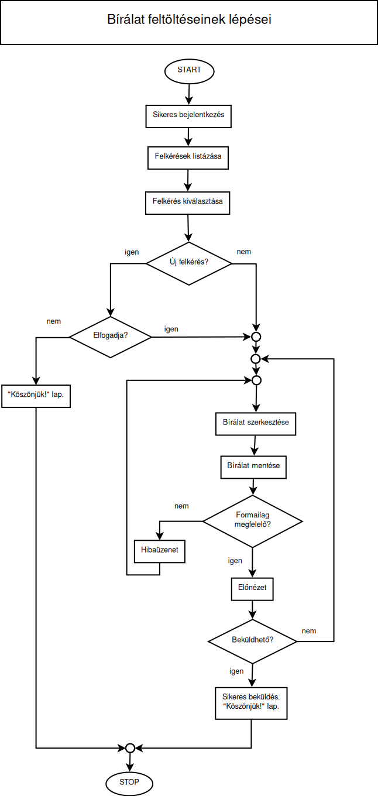

Szerepkörök leírása és Folyamatok ábrázolása
============================================

Repository létrehozása
----------------------

https://github.com/Ddavid111/Szakmai_Gyakorlat

Szerepkörök leírása
-------------------

1. *Hallgató*:

- Szakdolgozat létrehozása, szerkesztése és mentése a rendszerben.
- Az elkészült dolgozat benyújtása a rendszeren keresztül.
- Visszajelzések és észrevételek megtekintése a dolgozatról a bírálók, témavezető vagy a bizottság részéről.
- A bírálók és a bizottság értékeléseinek megtekintése.
- A védés időpontjának és helyszínének megtekintése és kezelése.
- A végső értékelés és jegy megtekintése.

2. *Bíráló*:

- A dolgozat értékelése és visszajelzés küldése a hallgatónak.
- A dolgozat nyomon követése és annak státuszának frissítése a rendszerben.
- Az értékelőlap és a végső jegy rögzítése a rendszerben.

3. *Záróvizsga jegyzője*:

- A záróvizsga időpontjának és helyszínének meghatározása és frissítése.
- A záróvizsga résztvevőinek (hallgató, bírálók, bizottság) értesítése és meghívók kiküldése.
- A záróvizsga jegyzőkönyvének vezetése és rögzítése a rendszerben.

4. *Záróvizsga bizottság elnöke*:

- A bizottság tagjainak kijelölése és módosítása.
- A záróvizsga menetének és a kérdéseknek meghatározása.
- A hallgató szakdolgozatának értékelése a bizottság véleménye alapján.
- A végső értékelés rögzítése a rendszerben.

5. *Témavezető*:

- A hallgatóval való kommunikáció és támogatás a szakdolgozat elkészítése során.
- A hallgató dolgozatának nyomon követése és visszajelzések küldése.
- A bírálók és a bizottság értékeléseinek megtekintése.
- A végső értékelés és jegy rögzítése a rendszerben.

Folyamat ábrázolása
-------------------
.. plantuml::

    @startuml
    title Bírálati folyamat (optimista eset)

    Elnök->Hallgató: Felkérés regisztrációra
    Hallgató->Elnök: Sikeres reg.
    Elnök->Témavezető: Felkérés bírálatra
    Témavezető->Bíráló: Felkérés bírálatra
    Bíráló->Elnök: Bírálat
    Témavezető->Elnök: Bírálat
    @enduml

**Leírás**

A rendszer célja, hogy hatékonyan kezelje a szakdolgozatok *Bírálati Folyamatát* és a kapcsolódó érintett szereplők közötti kommunikációt. A leírás az alábbi lépéseket foglalja össze:

#. *Elnök felkéri a Hallgatót a regisztrációra:* A folyamatot az *Elnök* indítja, amikor felkéri a *Hallgatót*, hogy regisztráljon a rendszerbe. Ez a lépés azt jelenti, hogy a *Hallgatónak* lehetősége van hozzáférni a szakdolgozat bírálati folyamatához.
 
#. *Hallgató sikeresen regisztrál:* A *Hallgató* sikeresen regisztrál a rendszerbe, és így jogosultá válik a szakdolgozatának bírálati folyamatára.
 
#. *Elnök felkéri a Témavezetőt a bírálatra:* Az *Elnök* felkéri a *Témavezetőt*, hogy végezze el a szakdolgozat bírálatát. Ez a lépés azt jelzi, hogy a *Témavezetőnek* feladata van értékelni és észrevételeket tenni a szakdolgozatról.
 
#. *Témavezető felkéri a Bírálót a bírálatra:* A *Témavezető* felkéri a *Bírálót*, hogy részt vegyen a szakdolgozat bírálatában. A *Bíráló* feladata a szakdolgozat objektív értékelése és véleményezése.
 
#. *Bíráló elküldi a bírálatot az Elnöknek:* A *Bíráló* elkészíti a bírálatát a szakdolgozatról, és elküldi azt az *Elnöknek*. Ez a lépés azt jelenti, hogy a *Bíráló* megosztja az észrevételeit és értékelését a szakdolgozatról a rendszer adminisztrátorával.
 
#. *Témavezető elküldi a bírálatot az Elnöknek:* A *Témavezető* szintén elkészíti a saját bírálatát a szakdolgozatról, és azt az *Elnöknek* küldi el. Ez a lépés lehetővé teszi, hogy mind a *Témavezető*, mind a *Bíráló* észrevételeit összevetve az *Elnök* döntést hozzon a szakdolgozattal kapcsolatban.

.. plantuml::

    @startuml
    title Többszörös bírálói felkérés folyamata

    participant Elnök as E
    participant Hallgató as H
    participant Témavezető as T
    participant Bíráló as B

    E->H: Felkérés regisztrációra
    H->E: Sikeres regisztráció
    E->T: Felkérés bírálatra
    T->B: Felkérés bírálatra

    loop Több bíráló
        alt Felkérés elfogadva
            note left of B 
            Elfogadva
            end note
        else Felkérés visszautasítva
            note left of B 
            Visszautasítva
            end note
        end
    end

    note right of T 
    Visszajelzés a bírálókról
    end note

    T -> E: Bírálat
    B -> E: Bírálat
    @enduml

**Leírás**

Ez a szekvenciadiagram lépésről lépésre bemutatja a *Többszörös Bírálói Felkérés Folyamatát*, a felkéréstől a végleges bírálati visszajelzésig. A leírás az alábbi lépéseket foglalja össze:

#. *Felkérés a regisztrációra:* A folyamatot az *Elnök* indítja, amikor felkéri a *Hallgatót*, hogy regisztráljon a rendszerbe. Ez a lépés azt jelenti, hogy a *Hallgatónak* lehetősége van hozzáférni a szakdolgozat bírálati folyamatához.

#. *Hallgató sikeresen regisztrál:* A *Hallgató* sikeresen regisztrál a rendszerbe, és így jogosultá válik a szakdolgozatának bírálati folyamatára.

#. *Elnök felkéri a Témavezetőt a bírálatra:* Az *Elnök* felkéri a *Témavezetőt*, hogy végezze el a szakdolgozat bírálatát. Ez a lépés azt jelzi, hogy a *Témavezetőnek* feladata van értékelni és észrevételeket tenni a szakdolgozatról.

#. *Témavezető felkéri a Bírálót a bírálatra:* A *Témavezető* felkéri a *Bírálót*, hogy részt vegyen a szakdolgozat bírálatában. A *Bíráló* feladata a szakdolgozat objektív értékelése és véleményezése.

#. *Elfogadás:* A *Bíráló* elfogadja a felkérést, és ezt jelzi.

#. *Visszautasítás:* A *Bíráló* visszautasítja a felkérést, és ezt jelzi.

#. *Visszajelzés a bírálókról:* A *Témavezető* visszajelzést ad az *Elnöknek* a bírálók elfogadásáról vagy visszautasításáról.

#. *Bíráló elküldi a bírálatot az Elnöknek:* A *Bíráló* elkészíti a bírálatát a szakdolgozatról, és elküldi azt az *Elnöknek*. Ez a lépés azt jelenti, hogy a *Bíráló* megosztja az észrevételeit és értékelését a szakdolgozatról a rendszer adminisztrátorával.

#. *Témavezető elküldi a bírálatot az Elnöknek:* A *Témavezető* szintén elkészíti a saját bírálatát a szakdolgozatról, és azt az *Elnöknek* küldi el. Ez a lépés lehetővé teszi, hogy mind a *Témavezető*, mind a *Bíráló* észrevételeit összevetve az *Elnök* döntést hozzon a szakdolgozattal kapcsolatban.

.. plantuml::
    
    @startuml
    title Hallgatók felvitele - Szekvenciadiagram

    participant Elnök as E
    participant Hallgató as H
    participant Jegyző as J

    note over E
    Hallgató adatok megadása
    end note
    note over E
    Adatok ellenőrzése és validáció
    end note

    E->>H: Felvételre kerültél!
    
    note over H 
    Belépés a rendszerbe
    end note
    
    note over H 
    Adatlap kitöltése
    end note
    
    H-->J: Új adatlap
    
    note over J 
    Új adatlap érkezett
    end note
    
    note over J 
    Adatlap ellenőrzése
    end note
    
    Jegyző->>Hallgató: Visszajelzés (ha szükséges)
    
    note over J 
    Adatlap jóváhagyása
    end note
    
    note over J 
    Jóváhagyott adatok rögzítése
    end note
    
    J-->>E: Adatlap jóváhagyva értesítés
    
    E-->>Hallgató: Adatlap jóváhagyva értesítés
    @enduml

**Leírás**

Ez a szekvenciadiagram részletesen szemlélteti a *Hallgatók felvitele* folyamatát az adatok megadásától az adatlap jóváhagyásának értesítéséig, mindezt az *Elnök*, *Hallgató* és *Jegyző* közötti interakciókkal.

#. *Hallgató adatok megadása:* Az *Elnök* megadja a *Hallgató* adatait a rendszerben, hogy felkészüljenek a regisztrációra. Az adatok tartalmazzák a szükséges információkat a *Hallgatóról*.

#. *Adatok ellenőrzése és validáció:* Az *Elnök* ellenőrzi és érvényesíti az adatokat, hogy biztos legyen a hitelességükben és a pontosságukban.

#. *Felvételre kerülés értesítése:* Az *Elnök* értesíti a *Hallgatót* a sikeres felvételről, és arról, hogy részt vehet a folyamatban.

#. *Belépés a rendszerbe:* A *Hallgató* belép a rendszerbe a saját fiókjába, hogy folytassa a felvételi folyamatot.

#. *Adatlap kitöltése:* A *Hallgató* kitölti az adatlapját a szükséges információkkal.

#. *Új adatlap értesítése:* A *Hallgató* elküldi az újonnan kitöltött adatlapot a *Jegyzőnek*, jelezve a további folyamat kezdetét.

#. *Adatlap ellenőrzése:* A *Jegyző* értesül arról, hogy új adatlap érkezett, majd alaposan ellenőrzi az adatokat és a kitöltött információkat.

#. *Visszajelzés és jóváhagyás:* A *Jegyző* visszajelzést küld a *Hallgatónak* az adatlap jóváhagyásáról, és esetleges korrekciókról, ha szükséges.

#. *Adatlap jóváhagyása:* Miután az adatlapot jóváhagyásra alkalmasnak találták, a *Jegyző* hivatalosan is jóváhagyja az adatlapot.

#. *Értesítés a jóváhagyásról:* A *Jegyző* értesíti az *Elnököt* az adatlap jóváhagyásáról és a felvétel sikerességéről.

#. *Adatlap jóváhagyásának értesítése a Hallgatónak:* Az *Elnök* értesíti a *Hallgatót* az adatlap jóváhagyásáról és a felvétel megerősítéséről.

**Leírás**

A folyamatábra bemutatja a szakdolgozat bírálat feltöltésének folyamatát a *Témavezető* és a *Bíráló* között.

#. *A Témavezető és a Bíráló bejelentkezik:* A *Témavezető* és a *Bíráló* is bejelentkezik a rendszerbe, hogy hozzáférjenek a szükséges funkciókhoz.

#. *Témavezető kilistázza és kiválasztja a Bírálót:* A *Témavezető* megjeleníti a rendszerben elérhető *Bírálók* listáját és a *Témavezető* kiválasztja a *Bírálót*.

#. *Felhasználók kiválasztják a szakdolgozatot:* Mind a *Témavezető*, mind a *Bíráló* kiválasztja a szakdolgozatot, amelyre a bírálatot el szeretné készíteni.

#. *A Felhasználók megírják a bírálatot:* Mind a *Témavezető*, mind a *Bíráló* megírja a bírálatot.

#. *Bírálat mentése és feldolgozása a rendszerben:* A rendszer elmenti és feldolgozza a feltöltött bírálatot.

#. *Rendszer ellenőrzi, hogy a bírálat PDF formátumban van és érvényes-e:* A rendszer ellenőrzi, hogy a bírálat valóban PDF formátumban van-e és érvényes-e.

#. *Rendszer előnézetet készít a bírálatból:* A rendszer előnézetet készít a bírálatból, hogy a *Témavezető* és a *Bíráló* ellenőrizhesse a dokumentumot.

#. *Témavezető szerkeszti a bírálatot (szükség esetén):* A *Témavezető* lehetősége van szerkeszteni a bírálatot, ha szükségesnek látja.

#. *Bíráló szerkeszti a bírálatot (szükség esetén):* A *Bírálónak* is lehetősége van szerkeszteni a bírálatot, ha szükségesnek tartja.

#. *Bírálat véglegesítése és mentése a rendszerben:* A *Témavezető* és a *Bíráló* véglegesíti a szerkesztéseket, majd a rendszer elmenti a végleges bírálatot.

#. *Visszajelzés a rendszerben a Témavezetőnek és a Bírálónak:* A rendszer visszajelzést küld mind a *Témavezetőnek*, mind a *Bírálónak* arról, hogy a bírálatuk sikeresen rögzítésre került.

#. *Témavezető és a Bíráló megtekinti a bírálatot:* Végül mind a *Témavezető*, mind a *Bíráló* megtekinti a véglegesített bírálatot a rendszerben.