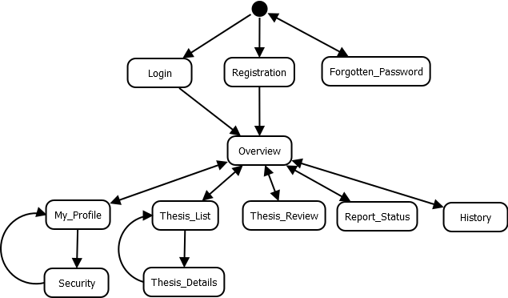
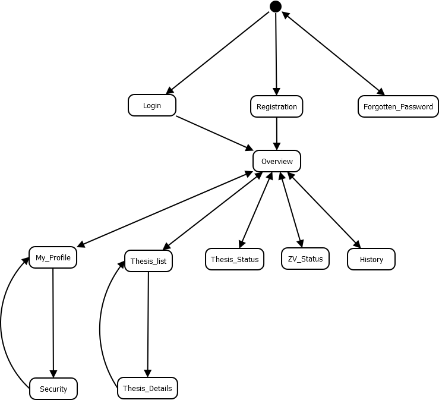
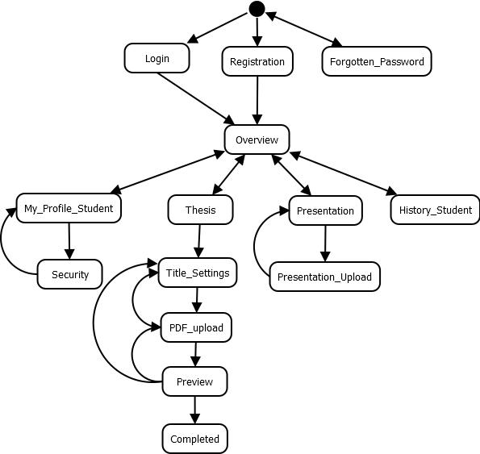

Lapok közötti átmenetek
=======================

Elnök
^^^^^

.. image:: images/Lapok_kozotti_atmenetek/Elnok.png

**Leírás**

A fenti ábrán az *Elnök* szemszögéből láthatjuk a rendszert. 

- Lehetősége van *Regisztrálni*, *Bejelentkezni*, és *Elfejtett jelszót* kérni. 
- A bejelentkezés után rögtön a főoldalra jut a felhasználó. 
- Innen lehetősége van megtekinteni a *Saját profilját* és ezen belül a *Biztonság* menüpontot, ahol a jelszót tudja megváltoztatni. 
- Ezenkívül hozzáférése lehet a *Szakdolgozatok listázásához* is amin belül az egyes *Szakdolgozatok részleteit* is megjelenítheti a felhasználó. 
- Lehetősége van *Záróvizsgát létrehozni*, a *Záróvizsgán kapott jegyeket* elkönyvelni illetve a *Záróvizsga jegyzőkönyvének letöltésére* is. 
- Megtekintheti a *Szakdolgozatok státuszát*, a *Bírálatokat* és a *Történetisgéet leíró lapot* is.

Bíráló
^^^^^^

**Leírás**

A fenti ábrán a *Bíráló* szemszögéből láthatjuk a rendszert. 

-L ehetősége van *Regisztrálni*, *Bejelentkezni*, és *Elfejtett jelszót* kérni. 
- A bejelentkezés után rögtön a főoldalra jut a felhasználó. 
- Innen lehetősége van megtekinteni a *Saját profilját* és ezen belül a *Biztonság* menüpontot, ahol a jelszót tudja megváltoztatni. 
- Ezenkívül hozzáférése lehet a *Szakdolgozatok listázásához* is amin belül az egyes *Szakdolgozatok részleteit* is megjelenítheti a felhasználó. 
- Megtekintheti a *Szakdolgozatok státuszát* és a *Történetiséget leíró lapot* is. Valamint bírálatot írhat a *Szakdolgozat Bírálat* lapon. 

Jegyző
^^^^^^

**Leírás**

A fenti ábrán a *Jegyző* szemszögéből láthatjuk a rendszert. 

- Lehetősége van *Regisztrálni*, *Bejelentkezni*, és *Elfejtett jelszót* kérni. 
- A bejelentkezés után rögtön a főoldalra jut a felhasználó. 
- Innen lehetősége van megtekinteni a *Saját profilját* és ezen belül a *Biztonság* menüpontot, ahol a jelszót tudja megváltoztatni. 
- Ezenkívül hozzáférése lehet a *Szakdolgozatok listázásához* is, amin belül az egyes *Szakdolgozatok részleteit* is megjelenítheti a felhasználó. 
- Megtekintheti a *Szakdolgozatok státuszát* és a *Történetiséget leíró lapot* is. 
- Lehetősége van a *Záróvizsgán kapott jegyek* rögzítésére illetve a *Záróvizsga jegyzőkönyv* letöltésére. 

Témavezető
^^^^^^^^^^

.. image:: images/Lapok_kozotti_atmenetek/Temavezeto.png

**Leírás**

A fenti ábrán a *Témavezető* szemszögéből láthatjuk a rendszert.

- Lehetősége van *Regisztrálni*, *Bejelentkezni*, és *Elfejtett jelszót* kérni. 
- A bejelentkezés után rögtön a főoldalra jut a felhasználó. 
- Innen lehetősége van megtekinteni a *Saját profilját* és ezen belül a *Biztonság* menüpontot, ahol a jelszót tudja megváltoztatni. 
- Ezenkívül hozzáférése lehet a *Szakdolgozatok listázásához* is, amin belül az egyes *Szakdolgozatok részleteit* is megjelenítheti a felhasználó. 
- Megtekintheti a *Szakdolgozatok státuszát* a *Bírálatot*, és a *Történetiséget leíró lapot* is. 
- Lehetősége van a *Záróvizsgán kapott jegyek* rögzítésére illetve a *Záróvizsga jegyzőkönyv* letöltésére. 

Hallgató
^^^^^^^^

**Leírás**

A fenti ábrán a *Hallgató* szemszögéből láthatjuk a rendszert. 

- Lehetősége van *Regisztrálni*, *Bejelentkezni*, és *Elfejtett jelszót* kérni. 
- A bejelentkezés után rögtön a főoldalra jut a felhasználó. 
- Innen lehetősége van megtekinteni a *Saját profilját* és ezen belül a *Biztonság* menüpontot, ahol a jelszót tudja megváltoztatni. 
- Ezenkívül hozzáférése lehet a *Szakdolgozatok listázásához* is, amin belül az egyes *Szakdolgozatok részleteit* is megjelenítheti a felhasználó. 
- Megtekintheti a *Történetiséget leíró lapot* is. 
- Lehetősége van a *Szakdolgozat feltöltésére*, ami különböző fázisokból áll kezdve az *Alapadatok* megadásától a *PDF felöltésen* át az *Előnézetig*. 
- A Záróvizsgára készült *prezentációt* is lehetősége van egy külön lapon feltölteni.