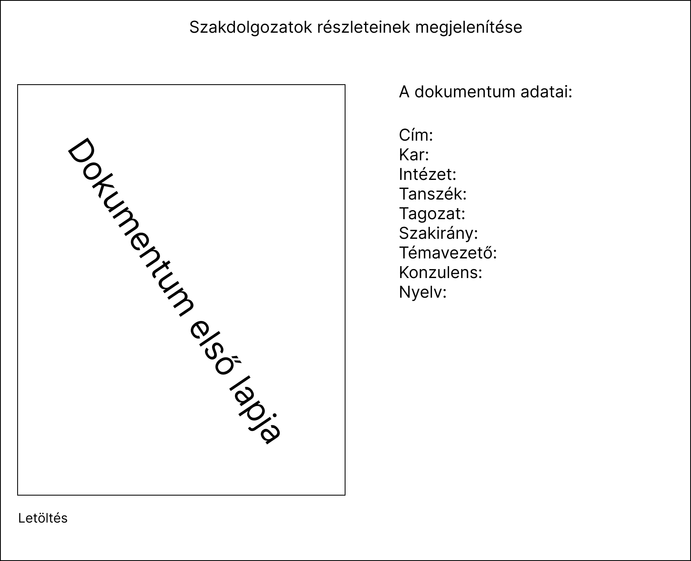
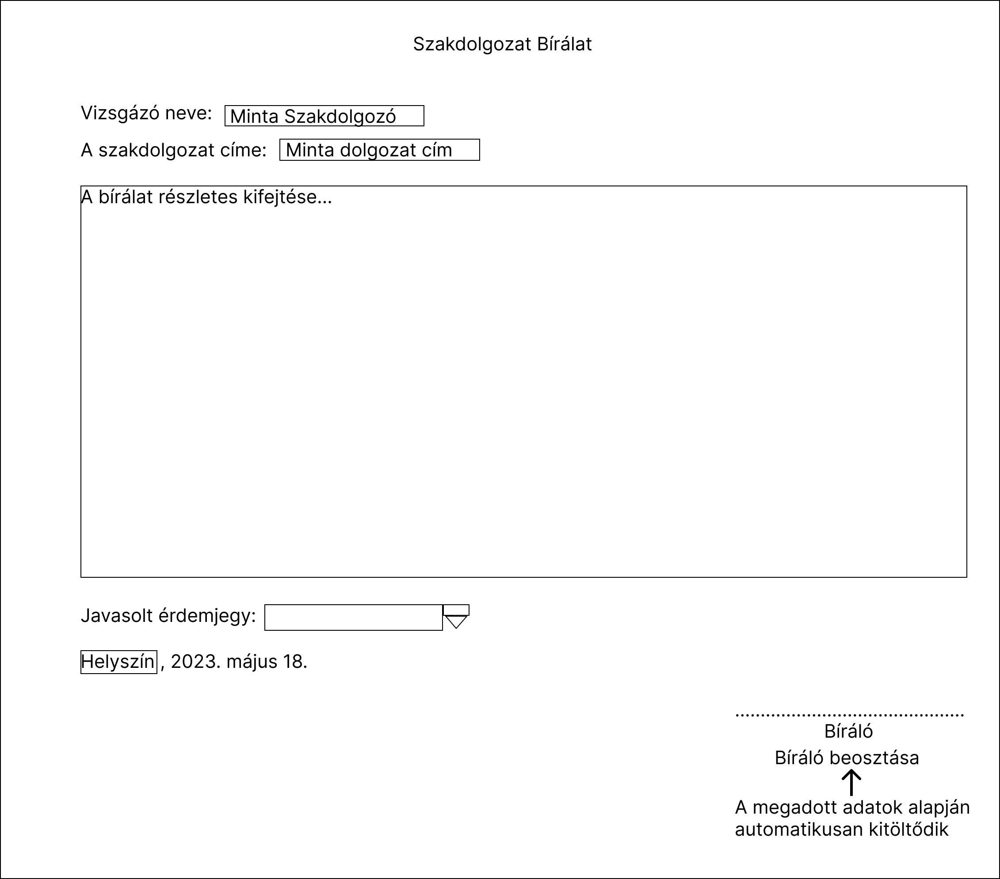
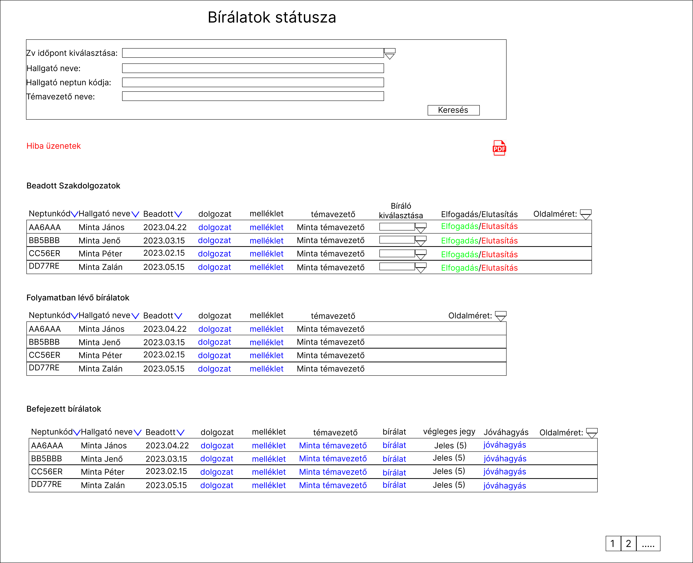
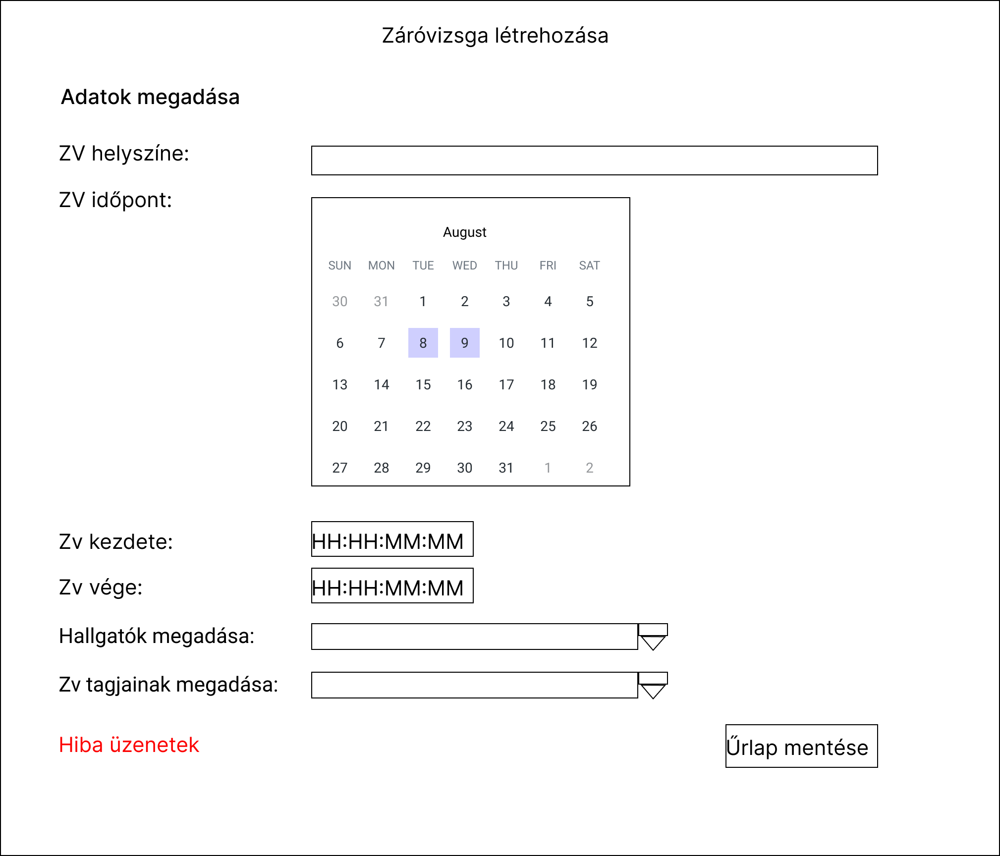
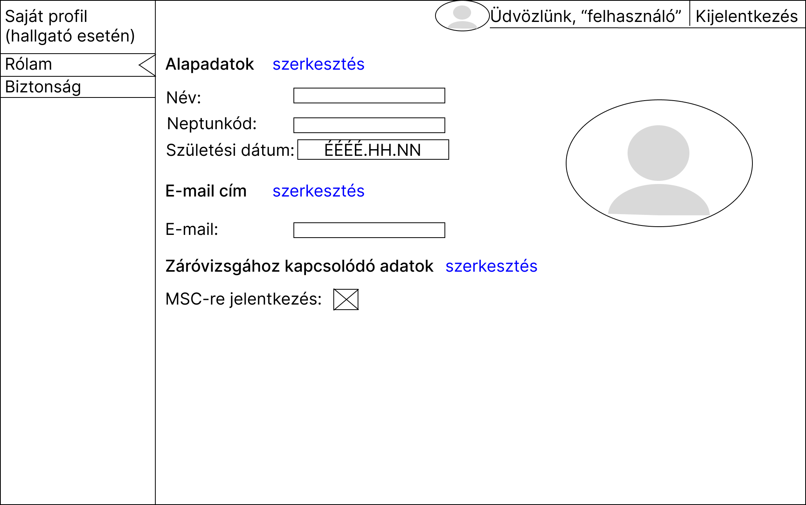
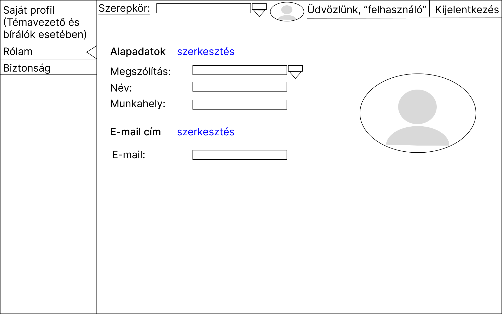
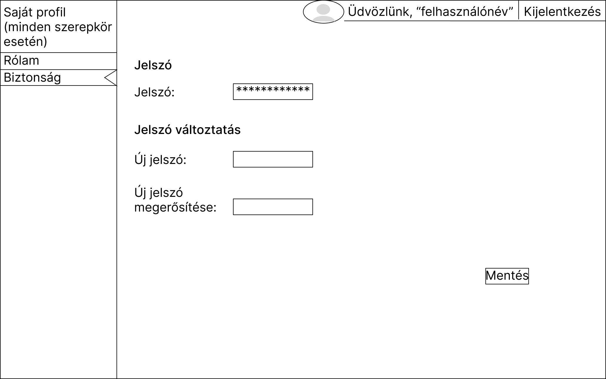

Lapok részletezése
==================

Bejelentkezés (Login)
---------------------

.. image:: images/Web_pages/Login.jpg

- A hibamező a hiányzó e-mail címet és/vagy jelszót jelzi.
- A hibaüzenet egy bejelentkezési próba után jelenik meg, amikor az e-mail-jelszó pár érvénytelen.

Lehetséges hibaüzenetek:

- Az e-mail cím hiányzik!

- Hiányzik a jelszó!

- Az e-mail cím vagy a jelszó érvénytelen!

Sikeres bejelentkezés után megnyílik a felhasználó irányítópult-oldala.

Regisztráció (Registration)
---------------------------

- A cím kivételével minden mező kitöltése kötelező.

- Hibaüzenet jelenik meg minden érvénytelen adatnál (a regisztrációs próba után).

- A helyreállítási link akkor jelenik meg, ha az e-mail cím már létezik.

Lehetséges hibaüzenetek:

- A keresztnév hiányzik!

- A családnév hiányzik!

- Az e-mail cím hiányzik!

- Az e-mail cím formátuma érvénytelen!

- A megadott e-mail cím már használatban van!

- A feltételek elfogadása nélkül nem regisztrálhat!

Sikeres regisztráció után megnyílik a felhasználó irányítópult-oldala.

Elfelejtett jelszó (Forgotten_Password)
---------------------------------------

Az Elküld gomb megnyomása után az alábbi üzenetek egyike jelenik meg.

- Egy e-mailt küldtünk a sample@address.com e-mail címre.

- Az e-mail cím formátuma érvénytelen!

- A sample@address.com e-mail cím nincs regisztrálva a Szerkesztői rendszerben.

- Hiba történt, miközben a rendszer megpróbálta elküldeni az e-mailt. Kérjük, próbálja újra később.

Sikeres e-mail küldés után a szövegbeviteli mező és a gomb eltűnik.

Szakdolgozatok listázása (Thesis_List)
--------------------------------------

A weblap a szakdolgozatok listázását mutatja.

- A hiba üzenet akkor jelenik meg ha a felhaszáló nem ad meg adatot illetve ha a felhasználó téves adatokat ad meg.

Szakdolgozat részletei (Thesis_Details)
^^^^^^^^^^^^^^^^^^^^^^^^^^^^^^^^^^^^^^^

A weblap egy adott szakdolgozat részleteit jeleníti meg. A lapot a *Szakdolgozatok listázása* lapból érhetjük el. 

Szakdolgozat feltöltése
-----------------------

A folyamat több lapból áll melyek átsegítik a felhasználót a szakdolgozat feltöltésében.

Alapadatok (Title_Settings)
^^^^^^^^^^^^^^^^^^^^^^^^^^^

.. image:: images/Web_pages/Title_Settings.png

Lehetséges hibaüzenetek:

- Nem töltöttél ki minden fontosabb mezőt.

- Mielőtt tovább lépsz kérlek mentsd az oldalt.

PDF Feltöltés (PDF_Upload)
^^^^^^^^^^^^^^^^^^^^^^^^^^

.. image:: images/Web_pages/PDF_Upload.jpg

Lehetséges hibaüzenetek:

- A fájl mérete túl nagy

- A fájl nem a megfelelő formátumban van

Előnézet (Preview)
^^^^^^^^^^^^^^^^^^

.. image:: images/Web_pages/Preview.jpg

Sikeres feltöltés (Completed)
^^^^^^^^^^^^^^^^^^^^^^^^^^^^^

Megtörtént a szakdolgozat sikeres feltöltése.

Szakdolgozatok státusza (Thesis_Status)
---------------------------------------

.. image:: images/Web_pages/Thesis_Status.jpg

A szakdolgozatok státuszáról egy összefoglaló táblázat látható.

Lehetséges hibaüzenetek:

- Nem adtál meg adatot

- Nincs találat

Szakdolgozat Bírálat (Thesis_Review)
------------------------------------

A *Témavezető* és a *Bíráló* itt írhatja meg a bírálatot.

Bírálatok státusza (Report_Status)
----------------------------------

Záróvizsga létrehozása (ZV_Create)
----------------------------------

Az *Elnök* itt hozhatja létre a záróvizsgát.

Záróvizsga jegyzőkönyv szerkesztése (ZV_Report)
-----------------------------------------------

.. image:: images/Web_pages/ZV_Report1.png
.. image:: images/Web_pages/ZV_Report2.png
.. image:: images/Web_pages/ZV_Report3.png
.. image:: images/Web_pages/ZV_Report4.png

A záróvizsga jegyzőkönyv szerkesztése látható itt. Pirossal azok a részek vannak kiemelve, amelyeket módosítani lehet.

Záróvizsga jegyek rögzítése és Záróvizsga jegyzőkönyv letöltése (ZV_Status)
---------------------------------------------------------------------------

.. image:: images/Web_pages/ZV_Status.png

- A *Jegyző* az *Elnök* és a *Témavezető* itt rögzítheti a Záróvizsgán kapott érdemjegyeket.

- A felhasználók innen tölthetik le a jegyzőkönyvet.

Saját profil [Hallgató] (My_Profile_Student)
--------------------------------------------

A Hallgató saját profilja látható a megadott adatok alapján.

Saját profil [A többi szerepkörre] (My_Profile)
----------------------------------------------------

Az *Elnök*, *Bíráló*, *Jegyző*, *Témavezető* saját profilja látható a megadott adatok alapján.    

Biztonság (Security)
--------------------

A jelszó változtatás itt történik meg.

Történetiséget leíró lap [Hallgató] (History_Student)
-----------------------------------------------------    

.. image:: images/Web_pages/History_Student.jpg

Egy történetiséget leíró lap látható, amin az egész szakdolgozat procedúra figyelhető meg.

Történetiséget leíró lap [Többi szerepkör] (History)
----------------------------------------------------------

Egy történetiséget leíró lap látható, amin az egész szakdolgozat procedúra figyelhető meg.

Prezentáció feltöltés (Presentation_Upload)
-------------------------------------------

.. image:: images/Web_pages/Presentation_Upload.jpg

A Záróvizsgához szükséges prezentáció feltöltés itt történik meg.